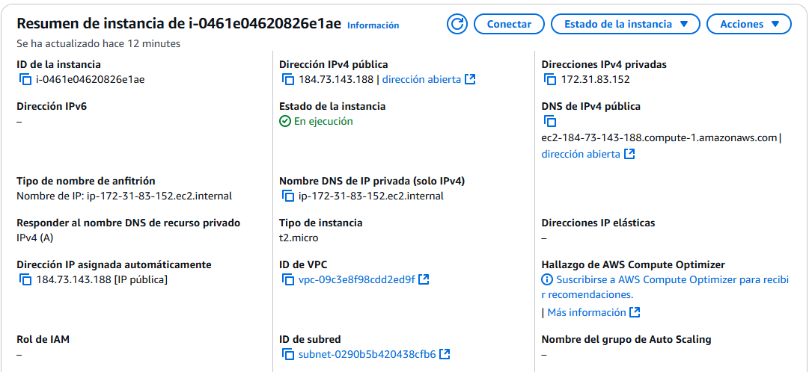
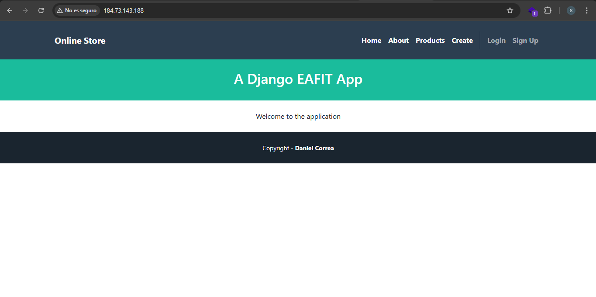

# Desarrollo del tutorial
Quiero resaltar que al seguir el paso a paso no me funcionaba. Pero me di cuenta de un error, hacía falta la siguiente línea en ´Dockerfile´ la cual añadí con el comando ´nano Dockerfile´:
```bash
CMD [ "python", "manage.py", "runserver", "0.0.0.0:80"]
```
## Instancia EC2


## Despliegue en nube


